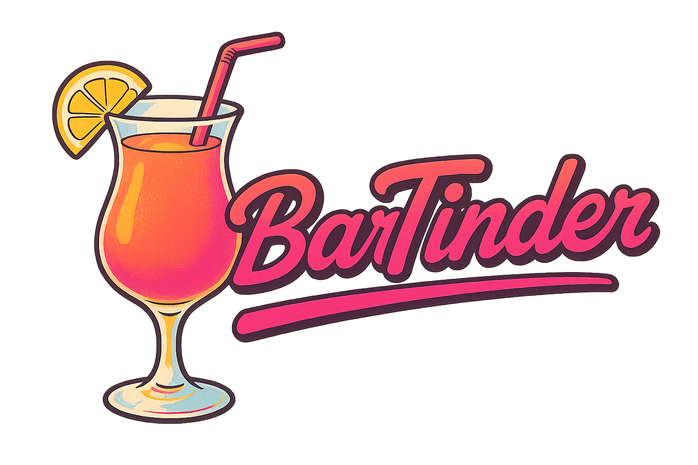
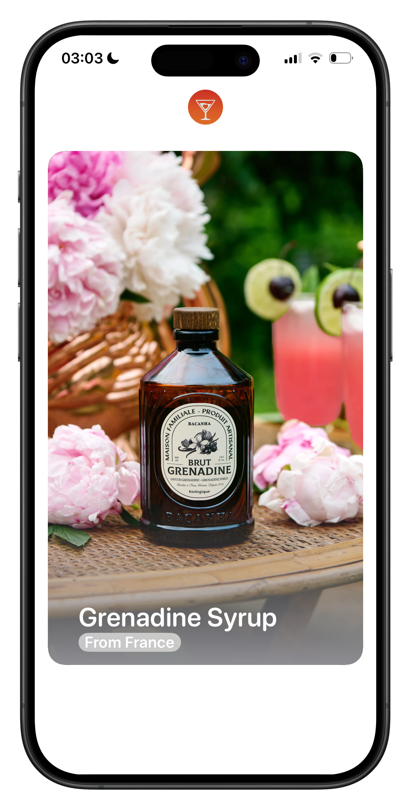
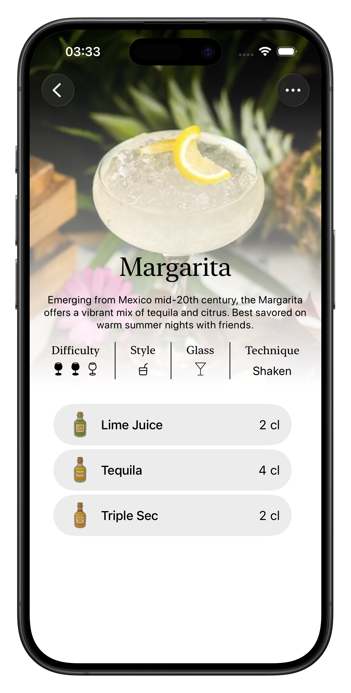
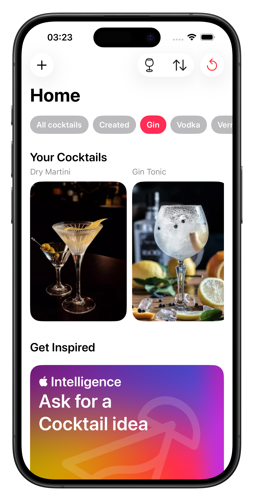
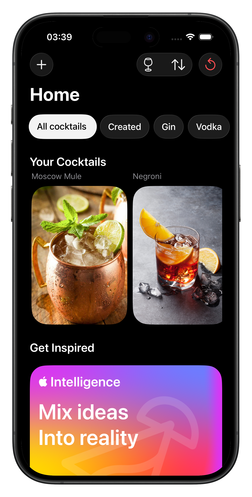
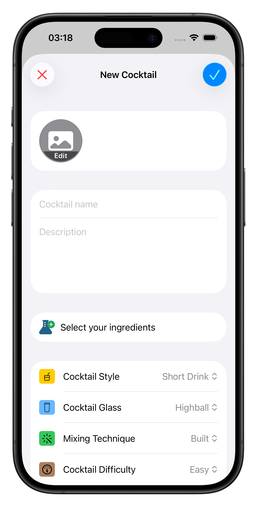
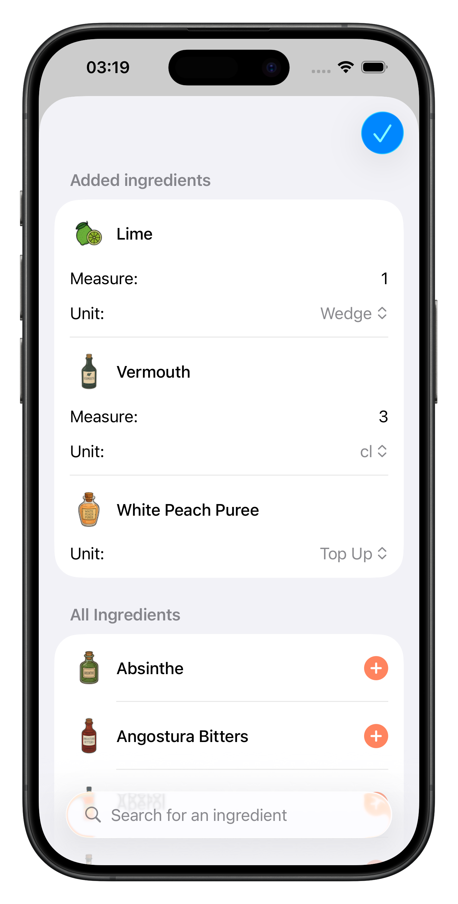
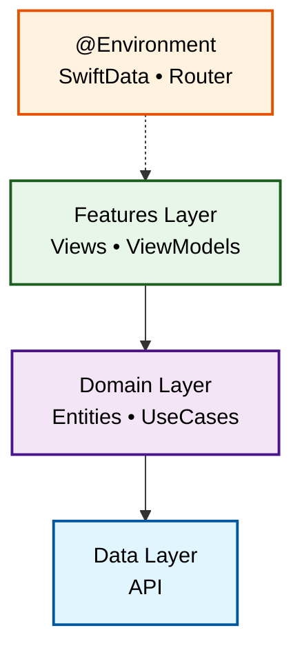
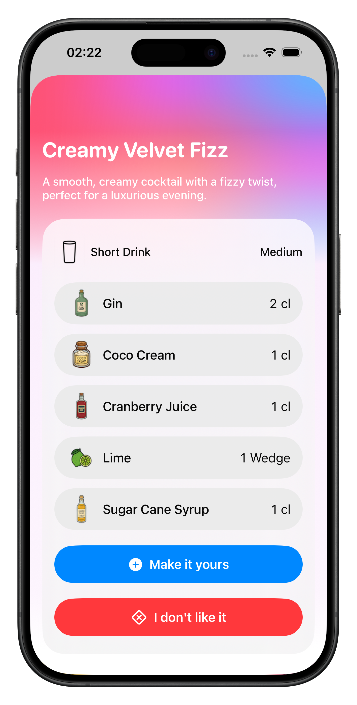

<div align="center">

  

  ### *Swipe your way to the perfect cocktail* 🥂
  
  
  
  
  

</div>

---

## **What is BarTinder?**

**BarTinder** is the ultimate cocktail discovery app that revolutionizes how you explore and create drinks. Think Tinder, but for cocktail ingredients!

<div align="center">

<p>
  
  
</p>

<p>
  
  
</p>

<p>
  
  
</p>

</div>

### **The Magic Flow**

1. **Swipe Ingredients** → Browse ingredient cards with satisfying swipe gestures
2. **Like or Pass** → Express your taste preferences
3. **Discover Cocktails** → Get personalized recommendations based on your choices
4. **Create Your Own** → Build custom cocktails with unlimited creativity

### **Built for Learning**

BarTinder is developed with the **simplicity and modernity of SwiftUI**, making it an excellent resource for developers at all levels. Whether you're a beginner learning iOS development or an experienced developer exploring the latest iOS 26 features, this project showcases:

- **Clean SwiftUI Views**: See how to structure views effectively
- **Refactoring Patterns**: Learn how to organize code for maintainability
- **Routing Architecture**: Understand navigation patterns in SwiftUI
- **Latest iOS 26 features**: Discover Apple’s newest APIs, including `@Observable`, Foundation Models, Swift Testing, and more!

Feel free to explore the codebase, learn from it, and use it as a reference for your own projects!

---

## **Features**

### **Core Experience**
- **Tinder-like Swiping**: Intuitive card-based ingredient selection
- **Recipe Discovery**: Explore cocktails you can make with liked ingredients
- **Custom Creation**: Build your own signature cocktails!

### **Creation Tools**
- **Recipe Builder**: Add ingredients with precise measurements
- **Visual Customization**: Upload cocktail photos and select your cocktails options among glassware, flavor, ABV..
- **Personal Library**: Save and organize your creations

### **AI-Powered Cocktail Generation**
- **Apple Intelligence Integration**: Leverage Foundation Models to generate creative cocktail ideas
- **Guided AI Output**: Use existing app data (ingredients, glassware, techniques) to constrain AI generation
- **One-Word Input**: Simply enter a word (like "Ocean", "Summer", or "Spicy") and let Apple Intelligence create a complete cocktail recipe
- **Structured Generation**: AI respects your app's domain model using `@Generable` and `@Guide` macros

---

## **Technical Architecture**

### **Clean Architecture Pattern**
Built with a robust **Clean Architecture** approach, ensuring:
- **Separation of Concerns**: Clear boundaries between UI, business logic, and data
- **Testability**: Isolated components for comprehensive testing
- **Maintainability**: Scalable and readable codebase
- **SOLID Principles**: Following best practices for iOS development



### **SwiftData Integration**

The app leverages **SwiftData** with a custom abstraction layer to handle draft context and to keep data logic out of views:

```swift
// Custom SwiftData extension for clean separation
extension ModelContext {
    func `switch`<T: PersistentModel>(for model: T) -> T {
        let ctx = ModelContext(self.container)
        ctx.autosaveEnabled = false
        guard model.modelContext != nil else {
            ctx.insert(model)
            return model
        }
        return ctx.model(for: model.persistentModelID) as? T ?? model
    }
  // ... 
}
```

**Benefits:**
- **No Context Pollution**: Views stay focused on presentation
- **Reusable Logic**: Switch the context for each `PersistentModel` item crossing a creation/edit view

---

### **Apple Intelligence with Foundation Models**

BarTinder leverages **Apple Intelligence** to generate creative cocktail recipes using a unique approach: **guiding AI with existing app data** to ensure generated cocktails respect the app's domain model.

<div align="center">
  
</div>

#### **The Challenge**
Traditional AI generation can produce inconsistent or invalid data. How do you ensure Apple Intelligence generates cocktails that match your app's structure (valid glassware, real ingredients, proper units)?

#### **The Solution: Guided Structured Generation**

Using the `@Generable` and `@Guide` macros from Foundation Models, we constrain AI output to only produce valid cocktails based on **existing app data**:

```swift
import FoundationModels

@Generable
struct CocktailIdea {
    // Free-form text generation
    @Guide(description: "A cool name for the cocktail")
    var name: String

    @Guide(description: "A short description for the cocktail")
    var description: String

    // Constrained to existing app data using .anyOf()
    @Guide(.anyOf(CocktailGlass.allCases.map(\.rawValue)))
    var glass: String

    @Guide(.anyOf(CocktailMixingTechnique.allCases.map(\.rawValue)))
    var mixingTechnique: String

    @Guide(.anyOf(CocktailStyle.allCases.map(\.rawValue)))
    var style: String

    @Guide(.anyOf(CocktailDifficulty.allCases.map(\.rawValue)))
    var difficulty: String

    // Nested structured generation with constraints
    @Guide(description: "The ingredients for the cocktail")
    var ingredients: [IngredientIdea]
}

@Generable
struct IngredientIdea {
    // Only ingredients that exist in the app
    @Guide(.anyOf(CardIngredient.ingredientCards.map(\.name)))
    var name: String

    // Constrained range for realistic amounts
    @Guide(description: "A number that represent the amount", .range(1...20))
    var amount: Int

    // Valid units only (cl, ml, wedge, etc.)
    @Guide(.anyOf(Units.allCases.map(\.rawValue)))
    var unit: String
}
```

#### **How It Works**

**1. User enters a single word** (e.g., "Ocean", "Tropical", "Smoky")

**2. ViewModel initiates streaming generation:**
```swift
@Observable
final class GenerableModel {
    let session: LanguageModelSession
    var cocktailIdea: LanguageModelSession.ResponseStream<CocktailIdea>.Snapshot?

    func generate() async {
        // Check device availability
        guard useCase.executeCheckingAvailability() else {
            notAvailable = true
            return
        }

        let prompt = "Give me an idea for a cocktail that represents the word \(word)"
        let streamingResponse = session.streamResponse(to: prompt, generating: CocktailIdea.self)

        do {
            // Real-time streaming updates
            for try await cocktailIdea in streamingResponse {
                self.cocktailIdea = cocktailIdea
            }
        } catch let error as LanguageModelSession.GenerationError {
            errorDetails = await errorUseCase.mapGenerationError(error)
        } catch {
            print("Unknown error")
        }
    }
}
```

**3. UseCase transforms AI output to domain model:**
```swift
final class GenerableUseCase {
    func executeCreateCocktail(cocktailIdea: Snapshot?) -> Cocktail? {
        guard let name = cocktailIdea?.content.name else { return nil }
        guard let ingredients = cocktailIdea?.content.ingredients else { return nil }
        guard let glass = CocktailGlass(rawValue: cocktailIdea?.content.glass ?? "highball") else { return nil }

        var finalIngredients: [Ingredient] = []
        for ingredient in ingredients {
            let newIngredient = Ingredient(
                name: ingredient.name ?? "",
                measure: String(ingredient.amount ?? 0),
                unit: Units(rawValue: ingredient.unit ?? "cl") ?? .cl
            )
            finalIngredients.append(newIngredient)
        }

        return Cocktail(
            name: name,
            ingredients: finalIngredients,
            style: glass,
            // ... other properties
        )
    }
}
```

#### **Key Features**

**Device Availability Checking**
```swift
func mapLanguageError() -> LanguageError? {
    switch model.availability {
    case .available:
        return nil
    case .unavailable(.deviceNotEligible):
        return LanguageError(
            title: "Device not supported",
            message: "Your device does not support Apple Intelligence."
        )
    case .unavailable(.appleIntelligenceNotEnabled):
        return LanguageError(
            title: "Apple Intelligence disabled",
            message: "You need to enable Apple Intelligence in Settings."
        )
    case .unavailable(.modelNotReady):
        return LanguageError(
            title: "Apple Intelligence isn't ready yet",
            message: "Please check your network connection try again in a few moments"
        )
    case .unavailable(let other):
        return LanguageError(title: "Something went wrong", message: "Reason: \(other)")
    }
}
```

**Performance Optimization with Prewarming**
```swift
// Prewarm model when user focuses on text field
.onChange(of: focus) { _, newValue in
    if newValue == .word {
        model.prewarm()
    }
}
```

**Streaming Responses for Real-Time Feedback**
- Users see cocktail details appear progressively
- Better UX than waiting for complete generation

#### **Why This Approach Works**

**Data Integrity**: AI can only generate cocktails with valid ingredients, glassware, and units that exist in your app

**Domain Consistency**: Generated cocktails seamlessly integrate into the app's existing architecture

**User Trust**: Users get realistic, actionable cocktail recipes, not random AI hallucinations

**Clean Architecture**: Foundation Models integration respects Use Cases → Repository → Domain model pattern

---

## **Tech Stack**

| Technology | Purpose |
|------------|---------|
| **SwiftUI** | Modern, declarative UI framework |
| **SwiftData** | Core Data successor for persistence |
| **Swift 6.2** | Latest language features & concurrency |
| **Foundation Models** | Apple Intelligence for AI-powered cocktail generation |
| **MVVM + Clean Architecture** | Scalable architectural pattern |
| **Swift Testing** | Modern testing framework |


---

## **Demo**

<div align="center">

### **📱 Watch the Full App Demo**
[](https://github.com/MathGnt/BarTinder/releases/download/1.0/BarTinder.mov)

*Full app walkthrough showing ingredient swiping, cocktail discovery, and creation features*

</div>

---

## **Getting Started**

### Prerequisites
- iOS 26.0+
- Xcode 16.0+

### Installation
1. Clone the repository
```bash
git clone https://github.com/MathGnt/BarTinder.git
```

2. Open in Xcode

3. Build and run!

---

## **Contributing**

Contributions are welcome! Feel free to:
- Report bugs
- Suggest features  
- Submit pull requests
- Star the project

---

## **License**

This project is licensed under the AGPL-3.0 License - see the [LICENSE](LICENSE) file for details.

---

<div align="center">
  
  ### *Made with ❤️ and 🎸*
  
  **If you like this project, don't forget to give it a ⭐!**

</div>
